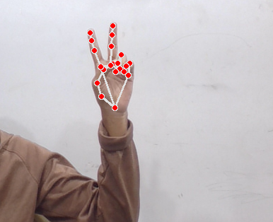
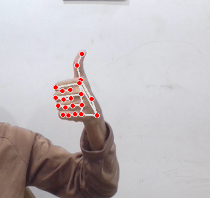
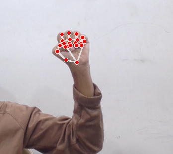
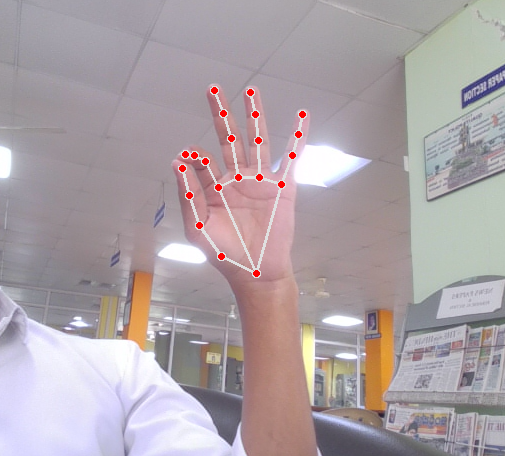
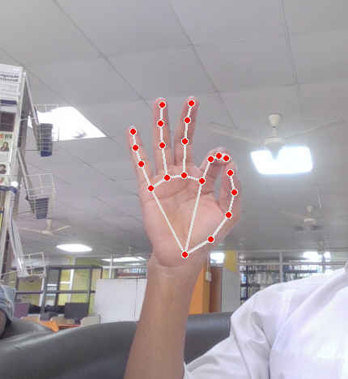
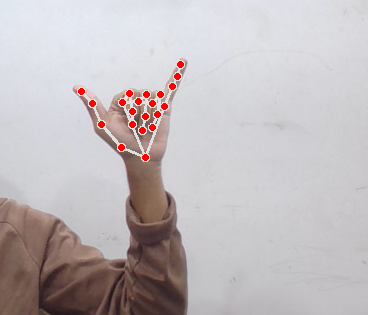
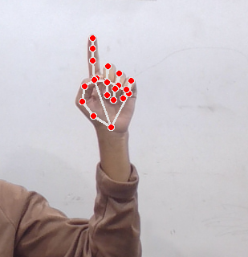

# Gesture-Controlled Virtual Mouse and Keyboard

> A real-time touchless Human–Computer Interaction system built using **Python**, **OpenCV**, **MediaPipe**, and **PyAutoGUI**.

## Features

- 🖱️ Virtual mouse control
- ⌨️ Virtual keyboard
- 🔊 Volume & brightness control
- 📜 Scrolling
- 🤏 Drag and drop
- ⚡ Low-latency gesture recognition

## Project Structure

```text
.github/
demo_media/
gest/
src/
.gitignore
README.md
requirements.txt
```

## Installation

```bash
git clone <repo-url>
cd Gesture-Controlled-Virtual-Mouse-and-Keyboard
pip install -r requirements.txt
python src/main.py
```

## Gesture Demonstration

> Place the extracted screenshots below inside the `demo_media/` folder and keep these filenames.

| Gesture | Image | Action |
|---------|-------|--------|
| Cursor Movement |  | Move cursor using Index + Middle finger |
| Left Click |  | Thumbs-Up |
| Double Click |  | Index finger overlapping middle finger |
| Drag & Drop |  | Closed fist |
| Volume/Brightness |  | Major hand pinch |
| Scrolling |  | Minor hand pinch |
| Virtual Keyboard |  | Shaka gesture |

## Results

Add the figures exported from your documentation into `demo_media/` and they will appear here.





## Performance

| Metric | Value |
|-------|------:|
| FPS | 30–45 |
| Latency | ≤50 ms |
| Detection | 21 landmarks |
| Camera | 640×480 |
| CPU | ~20% |
| Memory | ~200 MB |

## Tech Stack

- Python
- OpenCV
- MediaPipe
- PyAutoGUI
- PyCAW
- Screen Brightness Control

## Future Work

- Multi-user support
- Custom gestures
- Better low-light performance
- Deep-learning gesture recognition

## Authors

- L. Rahul
- Mohd Abdul Muqeet
- Mohammed Abdul Matheen
- Mohammed Talha

## License

MIT License

